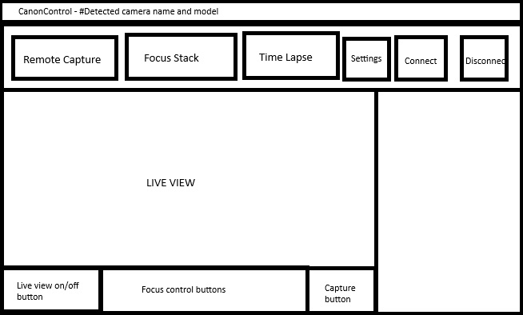

# CanonControl

Remote capture application for Canon DSLR using CanonSDK for hardware interaction, running on a Raspberry Pi with a PITFT50 touchscreen.

The purpose is to aid with focus-stacking photo shoots, where it is interesting not to touch the camera to avoid the
slightest movement and potentially alter the focus point.

## UI Sketch

## Canon SDK

### The Canon SDK library files needed can be obtained by registering for the Canon Developer Programme.

| Region   | URL                                                                            |
| -------- | ------------------------------------------------------------------------------ |
| Americas | https://developercommunity.usa.canon.com/                                      |
| Asia     | https://asia.canon/en/campaign/developerresources                              |
| Oceania  | Australia: https://www.canon.com.au/apps/eos-digital-software-development-kit  |
|          | New Zealand: https://www.canon.co.nz/apps/eos-digital-software-development-kit |
| China    | https://www.canon.com.cn/supports/sdk/index.html                               |
| Korea    | https://www.canon-ci.co.kr/support/sdk/sdkMain                                 |
| Japan    | https://cweb.canon.jp/eos/info/api-package/                                    |
| Europe   | https://developers.canon-europe.com/                                           |

## Avalonia UI

https://docs.avaloniaui.net/docs/reference/

## License

This project is licensed under the [Creative Commons Attribution-NonCommercial-ShareAlike 4.0 International License](https://creativecommons.org/licenses/by-nc-sa/4.0/).
